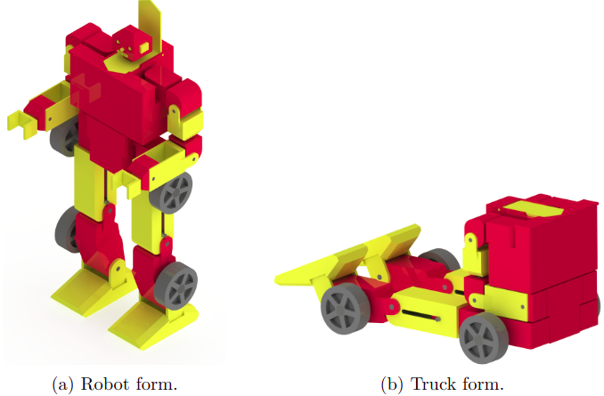
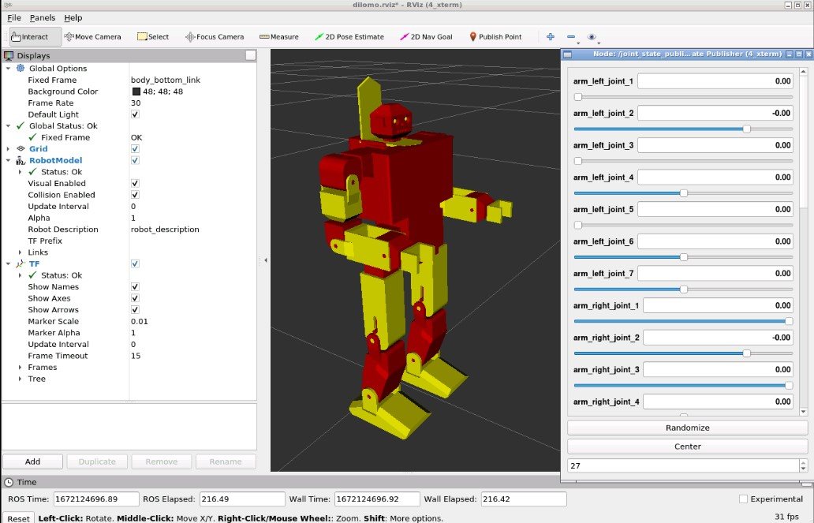
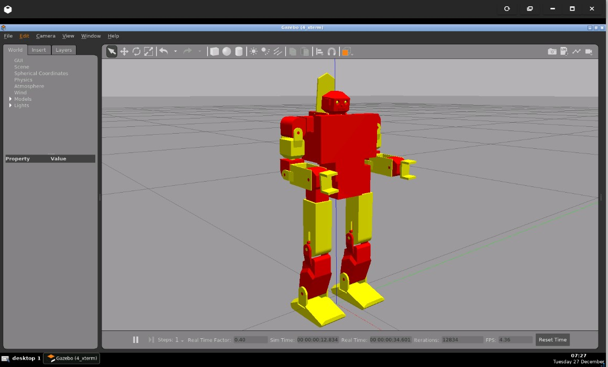

# DiLoMo :robot: :pickup_truck:

## Description
The DiLoMo robot is a humanoid biped robot able to transform from a human to a truck form.
This project relates the implementation of its control in Gazebo and RViz using the meta-operating system ROS (Noetic distribution).
It is realised for the electromechanical engineering course Robotics 2 of the VUB.

## Screenshots
- CAD of DiLoMo in Soliworks:

- RViz simulation:

- Gazebo simulation:


## Deployment

### RVIZ without control
In a terminal, write:

```bash
 cd ~/catkin_ws
source devel/setup.bash
roslaunch DiLoMo rviz_visualize.launch model:='$(find DiLoMo)/urdf/dilomo.urdf'
```
### RVIZ and Gazebo with control

In a first terminal, write the following command to open Gazebo:

```bash
cd ~/catkin_ws
source devel/setup.bash
roslaunch simulation_gazebo main.launch
```

To spawn the DiLoMo robot, write in a second terminal:
```bash
cd ~/catkin_ws
source devel/setup.bash
roslaunch DiLoMo start_dilomo_with_controller.launch
```

In a third terminal, write the following command to open RViz:

```bash
cd ~/catkin_ws
source devel/setup.bash
roslaunch DiLoMo rviz_control.launch model:='$(find DiLoMo)/urdf/dilomo.urdf'
```

To control in RViz and Gazebo, the following commands must be put in a  fourth terminal:
```bash
cd ~/catkin_ws
source devel/setup.bash
rosrun DiLoMo mingo_is_controlling.py
```

Finally, the robot must be re-spawn in Gazebo (as to get back on its feet). It can be done by either resetting the robot pose (CTRL+shift+R in Gazebo) or with the use of a service:
```bash
cd ~/catkin_ws
source devel/setup.bash
rosrun DiLoMo delete_dilomo.py
roslaunch DiLoMo start_dilomo_with_controller.launch
```

## Prerequisites
- Python3 <br />
- ROS Noetic <br />
- Gazebo <br />
- RViz <br />

## Release date
27-12-2022

## Members
:boy: Mohammedjavad Rahimi Dolatabad <br />
:boy: Yiming Yuan <br />
:girl: Louise Massager <br />
:boy: Dinh-Hao Nguyen <br />
